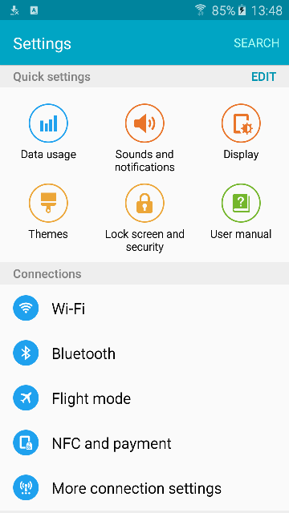

# Galaxy S6 Edge emulator

**Samsung Android 5.0.2 with TouchWiz, running in a Linux desktop window.**

Supply your firmware RAR and run one script. It downloads the tools, builds patched QEMU and the kernel, prepares Android, and opens the phone.

**Status: preview.** See [known limitations](#known-limitations) before using it.

## What you need

- A **Linux PC with an Intel or AMD processor** (`x86_64`). Windows, macOS, and ARM hosts are currently unsupported.
- A graphical desktop: X11, or Wayland with XWayland.
- **Python 3.10 or newer**, internet access for the first build, and `sudo` access to install missing packages.
- Recommended: **8 GB RAM and 30 GB free disk space**.
- Your own copy of this firmware:

  ```text
  G925FXXU1AOCV_OXE1AOD1_v5.0.2_Repair_Firmware.rar
  ```

Only the **SM-G925F G925FXXU1AOCV Android 5.0.2 repair RAR**, containing AP and CSC packages, is supported. Other S6 variants and firmware versions will be rejected. Firmware is not included.

## Quick start

### 1. Get the project

[Download the source ZIP](https://github.com/ducthoe/SM-G925F/archive/refs/heads/main.zip), extract it, and open a terminal inside the extracted folder. Keep the folder path free of spaces.

Or, if you have Git:

```sh
git clone https://github.com/ducthoe/SM-G925F.git
cd SM-G925F
```

### 2. Start the emulator

```sh
chmod +x run.sh scripts/install-dependencies.sh
./run.sh "/path/to/G925FXXU1AOCV_OXE1AOD1_v5.0.2_Repair_Firmware.rar"
```

Replace `/path/to/` with the location of your RAR. **Leave it compressed.** Run the command as your normal desktop user; the installer asks for your password when it needs `sudo`.

The first run downloads and compiles several large components, so it takes longer. Progress appears in the terminal. Missing packages are installed automatically on Debian/Ubuntu, Fedora, and Arch Linux.

### 3. Use Android

The phone opens in a window that fits the whole screen. A fresh device starts in English and skips setup.

| Action | Control |
| --- | --- |
| Tap | Left click |
| Swipe | Hold the left mouse button and drag |
| Recent apps / Home / Back | Buttons below the phone screen, or **F1 / F2 / F3** |
| Power / wake / sleep | **F4**; hold it for the power menu |
| Volume down / up | **F5 / F6**; hold to keep adjusting |
| Resize | Drag the window edges; the screen scales to fit |
| Internet | Enable **QEMU Wi-Fi** in Android's Wi-Fi settings |
| Sound | Use your Linux speakers or headphones and Android's volume controls |
| Root access | Open **SuperSU** in the app drawer |
| Stop | Close the QEMU window |

Keyboard shortcuts work while the phone screen has focus. On some laptops,
hold **Fn** to use F1–F6 instead of the laptop's media controls.

Screen locking follows Android's settings. PINs use the firmware's salted
software verification because Samsung's hardware credential store is unavailable
in this virtual phone.

## Run it again

After the first build, launch without providing the RAR:

```sh
./run.sh
```

It reuses the extracted firmware in `working/firmware/` and completed builds. Your apps and settings are saved in `state/`. Keep both folders when updating the project. If several firmware caches exist, select one with `./run.sh --firmware-id ID` using the ID shown in the error message.

Keep `state/` when updating the project. To try a separate, fresh phone without deleting your existing data:

```sh
./run.sh --state-dir "$PWD/state/fresh-phone"
```

## Minimal debloat mode

For a smaller app selection, launch with:

```sh
./run.sh --debloat
```

Debloat keeps the TouchWiz launcher, keyboard, Settings, Play Store and its Google
services, browser, clock, calculator, calendar, contacts, messages, gallery, and
file manager, together with essential Android services and accessibility tools.
It removes extra Samsung apps and services such as S Health, S Voice, Galaxy
Apps, Samsung account/cloud, themes, Edge panels, Smart Manager, and bundled
social, Microsoft, and Google media apps. The underlying Samsung UI remains.

Pass `--debloat` on each launch, including with `--build-only`. To return to the
regular app selection, use `./run.sh --no-debloat` (or simply omit `--debloat`).
Switching modes automatically rebuilds the adapted system image from the
preserved stock firmware. Saved phone data and apps you installed yourself stay
in `state/`; for a clean minimal phone, combine `--debloat` with a new
`--state-dir`.

**Fingerprint and Smart Remote are removed in both modes.**

## Update and rebuild

**A full rebuild is recommended after installing this performance update.** It changes the guest GLES driver, QEMU graphics transport, display conversion, and idle Wi-Fi/audio handling. GLES transfers now use batches of up to 64 KiB, and the display avoids an extra full-frame copy and per-pixel division.

Close the emulator, then run these commands from the project folder:

```sh
git pull
rm -rf working/qemu-g925-src/build working/kernel-old-build \
    working/emugl-compatible-build working/emugl-compatible \
    working/wifi working/audio working/storage
rm -f working/qemu-g925-src/.g925-build \
    working/firmware/*/.system-build working/firmware/*/.ramdisk-build
./run.sh --build-only
./run.sh
```

These commands preserve the extracted firmware in `working/firmware/`, downloads, the original RAR, and saved phone data in `state/`. The rebuild can take as long as the initial compilation. Use `--jobs 2` with `--build-only` if build memory is limited.

The updated build reached `sys.boot_completed=1` with SurfaceFlinger running and Wi-Fi configured on temporary disk overlays. Overall speed depends on the host and workload.

Virtual disks now use a dedicated QEMU I/O thread and the guest's `noop`
scheduler, so disk queue processing runs separately from the window and other
devices. Disk flushing is retained, and the I/O thread sleeps when idle.
The adapted system image also omits Samsung's **Device Test** app.
After updating, restart with `./run.sh` to rebuild the changed components
automatically and enable the keyboard shortcuts. Your saved phone data is kept.

For app switching, the firmware now keeps **six cached apps**, up from four.
ART retains 4–16 MB of free allocation space and starts with a 16 MB heap;
the stock 256 MB growth limit and 512 MB maximum heap are retained. The kernel
supports full preemption so foreground work can interrupt background kernel
work. Samsung's unsupported `sdp_cryptod` service is disabled to stop its restart
loop. These changes rebuild the kernel, matching modules, system image and
ramdisk automatically on the next run.

Recents disables an incompatible shader-binary optimization that could prevent
app-card graphics layers from being created and crash SystemUI.



## Useful options

Add these to `./run.sh` (or after the firmware path on the first build):

| Option | Use it to… |
| --- | --- |
| `--ram 4096 --cpus 4` | Assign 4 GB RAM and four virtual CPUs |
| `--renderer software` | Use software graphics if your GPU driver fails |
| `--adb-port 5557` | Choose a different localhost ADB port (default: 5555) |
| `--jobs 2` | Reduce memory use while compiling |
| `--debloat` / `--no-debloat` | Enable the minimal app selection / return to the regular selection (default: off) |
| `--build-only` | Download and build without opening Android |
| `--no-install` | Report missing dependencies without installing packages |
| `--help` | Show all options |

The default is up to **4 GB RAM and four virtual CPUs**. CPU emulation and software graphics can limit performance.

## Install APKs

Install [Android SDK Platform-Tools](https://developer.android.com/tools/releases/platform-tools) on your PC so `adb` is on your `PATH`. Start the emulator with `./run.sh`, wait for Android to boot, then run:

```sh
adb connect 127.0.0.1:5555
adb -s 127.0.0.1:5555 install -r "/path/to/app.apk"
```

Use ARM/ARM64 APKs compatible with Android 5.0 (API 21). `-r` updates an existing app while preserving its data.

ADB also supports a shell, logcat, and file transfers:

```sh
adb -s 127.0.0.1:5555 shell
adb -s 127.0.0.1:5555 logcat
adb -s 127.0.0.1:5555 push local-file /sdcard/
adb -s 127.0.0.1:5555 pull /sdcard/Download/
```

The host port is bound to `127.0.0.1`. ADB starts automatically over a separate virtual network link and works with Android Wi-Fi turned off. This local emulator connection does not require a USB debugging authorization prompt; the firmware's shell permissions are retained. Root commands can use the included SuperSU.

If port 5555 is occupied, launch with `./run.sh --adb-port 5557` and use `127.0.0.1:5557` in the commands above. After updating this project, close the emulator and start it again with `./run.sh`; the changed network module and ramdisk rebuild automatically.

## Common problems

**The build failed:** read the error and the log path printed in the terminal. Fix the reported problem and run the same command again; completed stages are kept. Package lists are in [the dependency installer](scripts/install-dependencies.sh).

**An older checkout reports HTTP 503 for `aarch64-gcc-4.9.tar.gz`:** stop that run, run `git pull`, then launch again. The compiler now comes from a GitHub mirror of the same pinned revision, with visible download progress.

**The screen is black or graphics initialization fails:** check `logs/renderer.log`, then try `--renderer software`. Launch from a terminal in your graphical desktop.

**There is no internet:** turn on Wi-Fi in Android and connect to **QEMU Wi-Fi**. It uses your PC's internet connection; it does not scan nearby physical access points.

**The browser reports no SD card:** update with `git pull`, close the current QEMU window, and launch with `./run.sh` again. The updated ramdisk starts the compatible emulated-storage daemon; your existing data is kept.

**There is no sound:** check Android's volume, the selected Linux audio output, and `logs/audio-host.log`. Playback supports PipeWire, PulseAudio, or ALSA.

**ADB does not connect:** wait for Android to boot, check the ADB address printed by the launcher, then run `adb disconnect 127.0.0.1:5555` followed by `adb connect 127.0.0.1:5555`. Use your selected port if you passed `--adb-port`. Guest startup diagnostics are in `/data/g925-adb.log`.

**It says another emulator is running:** this checkout allows one session at a time. Close its existing window before starting another.

When reporting a problem, include your Linux distribution, GPU, launch command, and the relevant log. Keep firmware and phone data out of bug reports.

## Known limitations

- Development has been verified on **Debian 13 with an NVIDIA Quadro M2000M**. Intel/AMD graphics and the Fedora/Arch installers still need verification on those hosts.
- Some Samsung icons and effects render incorrectly. Performance depends on your PC.
- Camera, cellular calls, NFC, physical sensors, and microphone input are unavailable.
- This runs an older Android release and includes SuperSU 2.49.

## For contributors

Build scripts are in `scripts/`, QEMU changes in `qemu/`, and the kernel port in `kernel/`. Downloads and generated files stay in `downloads/` and `working/`; phone data stays in `state/`.

The original firmware is preserved. Source revisions and checksums are recorded in `versions.json`. Upstream components retain their own licenses; see [source and license notices](NOTICE.md).
